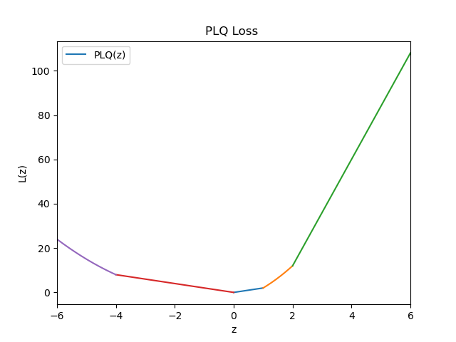
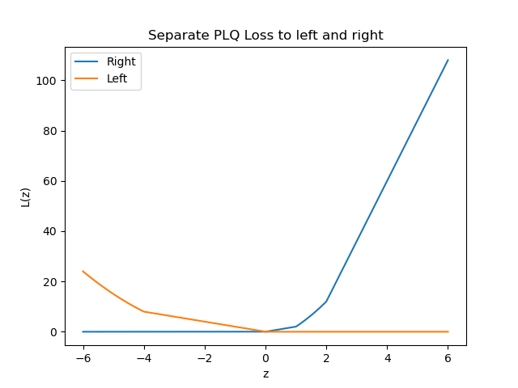
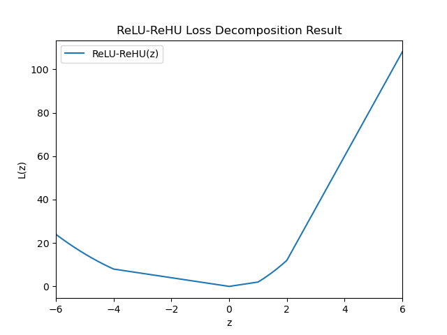

.. PLQComposite Decomposition documentation master file, created by
   sphinx-quickstart on Fri Feb 23 00:06:09 2024.
   You can adapt this file completely to your liking, but it should at least
   contain the root `toctree` directive.

Welcome to PLQ Composite Decomposition's documentation!
=======================================================

Introduction
------------

**Empirical risk minimization (ERM)[2]** is a crucial framework that
offers a general approach to handling a broad range of machine learning
tasks.

Given a general regularized ERM problem based on a convex **piecewise
linear-quadratic(PLQ) loss** with the form :math:`(1)` below.

.. math::

   \min_{\mathbf{\beta} \in \mathbb{R}^d} \sum_{i=1}^n  L_i( \mathbf{x}_{i}^\intercal \mathbf{\beta}) + \frac{1}{2} \Vert \mathbf{\beta} \Vert_2^2, \qquad \text{ s.t. } \mathbf{A} \mathbf{\beta} + \mathbf{b} \geq \mathbf{0},   \tag{1}

Let :math:`z_i=\mathbf{x}_ i^\intercal \mathbf{\beta}`, then
:math:`L_i(z_i)` is a univariate PLQ function.

**PLQ Composite Decomposition** is designed to be a computational
software package which adopts a **two-step method** (**decompose** and
**broadcast**) convert an arbitrary convex PLQ loss function in
:math:`(1)` to a **composite ReLU-ReHU Loss** function with the form
:math:`(2)` below.

.. math::

   L_i(z)=\sum_{l=1}^L \text{ReLU}( u_{l} z + v_{l}) + \sum_{h=1}^H {\text{ReHU}}_ {\tau_{h}}( s_{h} z + t_{h}) \tag{2}

where :math:`u_{l},v_{l}` and :math:`s_{h},t_{h},\tau_{h}` are the
ReLU-ReHU loss parameters. The **ReLU** and **ReHU** functions are
defined as

.. math:: \mathrm{ReLU}(z)=\max(z,0)

and

.. math::

   \mathrm{ReHU}_\tau(z) =
     \begin{cases}
     \ 0,                     & z \leq 0 \\
     \ z^2/2,                 & 0 < z \leq \tau \\
     \ \tau( z - \tau/2 ),   & z > \tau
     \end{cases}.

Finally, users can utilize ReHLine which is another useful software
package to solve the ERM problem.

Links
-----

-  Github Repo: https://github.com/keepwith/PLQComposite
-  Documentation:https://plqcomposite.readthedocs.io
-  Open Source License: `MIT
   license <https://opensource.org/licenses/MIT>`__
-  Download Repo:
   ``$ git clone https://github.com/keepwith/PLQComposite.git``

Formulation
-----------

Decompose Stage
~~~~~~~~~~~~~~~

In decompose stage, the main task is to convert a single convex PLQ Loss
function :math:`L(z)` with form :math:`(plq)` and :math:`(minimax)` to
the form :math:`(ReLU-ReHU)`

.. math::

   L(z)=
   \begin{cases}
   \ a_0 z^2 + b_0 z + c_0, & \text{if } z \leq d_0, \\
   \ a_i z^2 + b_i z + c_i, & \text{if } d_{i-1} < z \leq d_{i}, i=1,2,...,n-1 \\
   \ a_n z^2 + b_n z + c_n, & \text{if } z > d_{n-1}.
   \end{cases}
   \label{plq}
or

.. math::

   L(z)=max \lbrace a_{i} z^2 + b_{i} z + c_{i} \rbrace.  i=1,2,...,n
   \tag{minimax}

.. math::

   L(z)=\sum_{l=1}^L \text{ReLU}( u_{l} z + v_{l}) + \sum_{h=1}^H {\text{ReHU}}_ {\tau_{h}}( s_{h} z + t_{h}) \tag{ReLU-ReHU}

A Decompose Example
^^^^^^^^^^^^^^^^^^^

Given a continous convex PLQ Loss function with the form :math:`(a1)`
below

.. math::

   L(z)=
   \begin{cases}
   \ z^2 + 2z, & \text{if } z \leq -4, \\
   \ -2z, & \text{if } -4 < z \leq 0 \\
   \ 2z, & \text{if } 0 < z \leq 1 \\
   \ 2z^2 + 4z -4, & \text{if } 1 < z \leq 2 \\
   \ 24z -36, & \text{if } z > 2
   \end{cases}
   \label{a1}

| **Separate it to left and right from the minimum point**
| The minimum archived when :math:`z=0` and :math:`L(z)=0`
| Separate :math:`L(z)` from :math:`z=0` to :math:`L_{left}(z)` and
  :math:`L_{right}(z)` below

.. math::

   L_{left}(z)=
   \begin{cases}
   \ z^2 + 2z, & \text{if } z \leq -4, \\
   \ -2z, & \text{if } -4 < z \leq 0 \\
   \ 0, & \text{if } z>0
   \end{cases}
   \label{a2}

.. math::

   L_{right}(z)=
   \begin{cases}
   \ 0, & \text{if }  z \leq 0 \\
   \ 2z, & \text{if } 0 < z \leq 1 \\
   \ 2z^2 + 4z -4, & \text{if } 1 < z \leq 2 \\
   \ 24z -36, & \text{if } z > 2
   \end{cases}
   \label{a3}

| **Decompose to ReLU-ReHU piecewisely** For the :math:`L_{right(z)}` in
  :math:`(a3)`
| Work from each cutpoints from left to right, remove a tangent line
  from left then we have

.. math::

   \begin{eqnarray}
   g_{right,i}(z) &=& L_{right,i}(z) -(L_{right,i-1}^{\prime}(z_{i-1})(z-z_{i-1})+L_{right,i-1}(z_{i-1})) \\
                 &=& a_{i}z^2 + b_{i}z + c_{i} - \left[ (2a_{i-1}z_{i-1}+b_{i-1})(z-z_{i-1}) + a_{i}z_{i-1}^2+b_i z_{i-1} + c_i \right] \\
                 &=& \frac{(\sqrt{2a_i}z-\sqrt{2a_i}z_{i-1})^2}{2} + \left[ 2z_{i-1}(a_{i}-a_{i-1}+(b_{i}-b_{i-1})\right] (z-z_{i-1})
   \end{eqnarray}
   \label{a4}

| where :math:`z_{i-1}` is the cutpoints,
  :math:`a_i,b_i,c_i,a_{i-1},b_{i-1},c_{i-1}` are the coefficients of
  piece :math:`i` and :math:`i-1`
| We can know that the first term is a **ReHU** and the second term is a
  **ReLU**\ 。 :math:`g_{right,1}(z)=2z=ReLU(2z)`
| :math:`g_{right,2}(z)=2z^2+2z-4=ReLU(6z - 6) + ReHU_{2}(2z-2)`
| :math:`g_{right,3}(z)=12z-24=ReLU(12z - 24)`

| For the the :math:`L_{left(z)}` in :math:`(a2)` Work from each
  cutpoints from right to left, remove a tangent line from right then we
  will get similar result. :math:`g_{left,1}(z)=-2z=ReLU(-2z)`
| :math:`g_{left,2}(z)=z^2+4z=ReLU(6z - 6) + ReHU_{2}(2z-2)`

Then we will get a :math:`(ReLU-ReHU)` form of :math:`L(z)`

Broadcast Stage
~~~~~~~~~~~~~~~

In broadcast stage, then main task is to broadcast the :math:`L(z)` with
the form :math:`(ReLU-ReHU)` in decompose stage to all the data points.
i.e. generate :math:`L_i(z_i)` from the :math:`L(z)` above.

Usually, there exists a special relationship (If relationship not holds,
you have to mannully do the decomposition stage n times)

.. math:: L_i(z_i)=c_{i}L(p_{i}z_{i}+q_{i}) \tag{b1}

On the other hands, from the **Proposition 1 in [1]** the composite
:math:`(ReLU-ReHU)` function class is closed under affine
transformations.

**Proposition 1 (Closure under affine transformation).** If :math:`L(z)`
is a composite :math:`ReLU-ReHU` function as in :math:`(ReLU-ReHU)`,
then for any
:math:`c>0,\  p\in\mathbb{R}, \ and \ q\in\mathbb{R}, \ cL(pz+q)` is
also composite :math:`ReLU-ReHU` function, that is,

.. math::

   cL(pz+q)=\sum_{l=1}^L \text{ReLU}( u_{l}^{\prime} z + v_{l}^{\prime}) + \sum_{h=1}^H {\text{ReHU}}_ {\tau_{h}^{\prime}}( s_{h}^{\prime} z + t_{h}^{\prime}), \tag{b2}

:math:`where \ u_{l}^{\prime}=cpu_{l}, \ v_{l}^{\prime}=cu_{l}q+cv_{l}, \ \tau_{h}^{\prime}=\sqrt{c}\tau_{h},\ s_{h}^{\prime}=\sqrt{c}ps_{h}, \ and \ t_{h}^{\prime}=\sqrt{c}(s_{h}q+t_{h}).`

we combine :math:`(b1)` and :math:`(b2)`, then we have

.. math::

   L_{i}(z_{i})=c_{i}L(p_{i}z_{i}+q_{i})=\sum_{l=1}^L \text{ReLU}( u_{li}^{\prime} z_{i} + v_{li}^{\prime}) + \sum_{h=1}^H {\text{ReHU}}_ {\tau_{hi}^{\prime}}( s_{hi}^{\prime} z_{i} + t_{hi}^{\prime}), \tag{b3}

substitute :math:`(b3)` to :math:`(1)` then we have

.. math::

   \min_{\mathbf{\beta} \in \mathbb{R}^d} \sum_{i=1}^n \sum_{l=1}^L \text{ReLU}( u_{li} \mathbf{x}_ i^\intercal \mathbf{\beta} + v_{li}) + \sum_{i=1}^n \sum_{h=1}^H {\text{ReHU}}_ {\tau_{hi}}( s_{hi} \mathbf{x}_ i^\intercal \mathbf{\beta} + t_{hi}) + \frac{1}{2} \Vert \mathbf{\beta} \Vert_2^2, \qquad \\
   \text{ s.t. } \mathbf{A} \mathbf{\beta} + \mathbf{b} \geq \mathbf{0}, \label{b4}

where
:math:`\mathbf{U} = (u_{li}),\mathbf{V} = (v_{li}) \in \mathbb{R}^{L \times n}`
and
:math:`\mathbf{S} = (s_{hi}),\mathbf{T} = (t_{hi}),\mathbf{\tau} = (\tau_{hi}) \in \mathbb{R}^{H \times n}`
are the ReLU-ReHU loss parameters, and :math:`(\mathbf{A},\mathbf{b})`
are the constraint parameters.

With the above parameters and data, we can utilize ReHLine library to
solve the ERM problem.

To help you understand this operation better, we give the parameter of
the broadcast of some widely used loss functions.

**Widely Used Loss Functions and Broadcast Parameters** \| PROBLEM \|
Loss( :math:`L_i (z_i)` ) \| :math:`L(z)` \| Broadcast Parameters\| \|
—- \| —- \| —- \| —- \| \|\ :math:`SVM` \|
:math:`c_{i}(1-y_{i} z_{i})_{+}` \|

.. math:: L(z)=\begin{cases} 0 &\text{if } z < 0 \\  z &\text{if } z \geq 0 \end{cases}

\ \|\ :math:`p_{i}=-y_{i}, \ q_{i}=1, \ c_{i}=c_{i}` \| \|\ :math:`sSVM`
\| :math:`c_{i}ReHU_{1}(-(y_{i} z_{i}-1))`\ \|\

.. math:: L(z)=\begin{cases}\ 0 &\text{if } z < 0 \\ \ \frac{z^{2}}{2} &\text{if } 0 \leq z < 1 \\ \ z-\frac{1}{2} &\text{if } z \geq 1 \end{cases}

\| :math:`p_{i}=-y_{i}, \ q_{i}=1, \ c_{i}=c_{i}` \|
\|\ :math:`SVM^2`\ \|\ :math:`c_{i}((1-y_{i} z_{i})_{+})^{2}` \|

.. math:: L(z)=\begin{cases}\ 0 &\text{if } z < 0 \\ \ z^{2} &\text{if } z \geq 0 \end{cases}

\ \|\ :math:`p_{i}=-y_{i}, \ q_{i}=1, \ c_{i}=c_{i}` \|
\|\ :math:`LAD`\ \|\ :math:`c_{i} \| y_{i}-z_{i}\|` \|

.. math:: L(z)=\begin{cases}\ -z &\text{if } z < 0 \\ \ z &\text{if } z \geq 0 \end{cases}

\ \| :math:`p_{i}=-1, \ q_{i}=y_{i}, \ c_{i}=c_{i}` \| \|\ :math:`SVR`
\| :math:`c_{i} (\| y_{i}-z_{i}\|-\epsilon)_{+}`\ \|\

.. math:: L(z)=\begin{cases}\ -z-\epsilon &\text{if } z < -{\epsilon} \\ \ 0 &\text{if } -{\epsilon} \leq z < {\epsilon} \\ \ z-{\epsilon} &\text{if } z \geq {\epsilon} \end{cases}

\| :math:`p_{i}=-1, \ q_{i}=y_{i}, \ c_{i}=c_{i}` \| \|\ :math:`QR` \|
:math:`c_{i} \rho_{\kappa}(y_{i}-z_{i})`\ \|\

.. math:: L(z)=\begin{cases}\ ({\kappa}-1)z &\text{if } z < 0 \\ \ {\kappa}z &\text{if } z \geq 0 \end{cases}

\ \| :math:`p_{i}=-1, \ q_{i}=y_{i}, \ c_{i}=c_{i}` \|\|

Core Modules
------------

**Class:PLQLoss**
~~~~~~~~~~~~~~~~~

A class represents a univarite continuous convex piecewise
linear-quadratic(PLQ) Loss function.

| **quad_coef:**
| It is a dictionary stores the coefficients in pieces of the PLQoss The
  i-th piece is: :math:`a_ix^2 + b_ix + c_i`
| **form:**
| means the form of PLQLoss.
| Two types of input are accepted (plq) and (minimax).
| **cutpoints:**
| In plq form, cutpoints should be given. In minimax form, the cutpoints
  will be calculated by the built-in function **minimax2plq**.

**Usage**

.. code:: python

   import numpy as np
   from plqcom.PLQLoss import PLQLoss

   # create type 1 (plq)
   cutpoints_1 = np.array([0., 1.])
   quad_coef_1 = {'a': np.array([0., .5, 0.]), 'b': np.array([-1, 0., 1]), 'c': np.array([0., 0., -.5])}
   plq_loss_1 = PLQLoss(quad_coef_1, cutpoints=cutpoints_1, form="plq")

   # create type 2 (minimax)
   quad_coef_2 = {'a': np.array([0., 0., 0.]), 'b': np.array([-1, 0., 1]), 'c': np.array([-1., 0., -1.])}
   plq_loss_2 = PLQLoss(quad_coef_2, form="minimax")

   # You can also evaluate the plqloss directly
   x = np.arange(-2,2,.05)
   plq_loss_1(x)

\**PLQLoss:_2ReHLoss*\*
^^^^^^^^^^^^^^^^^^^^^^^

| A method convert the above PLQLoss to :math:`(ReLU-ReHU)` form.
| It will return a ReHLoss object with relu and rehu parameters. Just
  like :math:`(ReLU-ReHU)` form.

**Usage**

.. code:: python

   rehloss=plq_loss_1._2ReHLoss()

**ReHProperty:Affine transformation**
^^^^^^^^^^^^^^^^^^^^^^^^^^^^^^^^^^^^^

| The purpose of this function is to utilize :math:`(b1)` and
  **Proposition 1 (Closure under affine transformation)** of ReHLoss to
  broadcast :math:`L(z)` to all :math:`L_i(z_i)=c_iL(pz_i+q)`
| **rehloss** : A ReHLoss object
| **c:** scale parameter on loss function and require c > 0
| **p:** scale parameter on :math:`z_i`
| **q:** shift parameter on :math:`z_i`
| **n:** the length of the data
| The :math:`c`, :math:`p`, :math:`q` above can be either a single
  number or an array.
| A single number stands for all :math:`c_i` (or :math:`p_i`,
  :math:`q_i`) are the same for all :math:`i`. An array with the length
  n means they differ.

**Usage**

.. code:: python

   # simulate classification dataset
   n, d, C = 1000, 3, 0.5
   np.random.seed(1024)
   X = np.random.randn(1000, 3)
   beta0 = np.random.randn(3)
   y = np.sign(X.dot(beta0) + np.random.randn(n))

   rehloss=plq_loss_1._2ReHLoss()
   rehloss = affine_transformation(rehloss, n=X.shape[0], c=C, p=-y, q=1)

Examples
--------

Test SVM on simulated dataset
~~~~~~~~~~~~~~~~~~~~~~~~~~~~~

.. code:: python

   import numpy as np
   from plqcom.PLQLoss import PLQLoss
   from plqcom.ReHProperty import affine_transformation
   from rehline import ReHLine

   # simulate classification dataset
   n, d, C = 1000, 3, 0.5
   np.random.seed(1024)
   X = np.random.randn(1000, 3)
   beta0 = np.random.randn(3)
   y = np.sign(X.dot(beta0) + np.random.randn(n))

   # Step-1: Create a PLQLoss and call _2ReHLoss method to convert it to ReLU-ReHU form
   plqloss = PLQLoss(quad_coef={'a': np.array([0., 0.]), 'b': np.array([0., 1.]), 'c': np.array([0., 0.])},
                     cutpoints=np.array([0]))
   rehloss = plqloss._2ReHLoss()

   # Step-2: Use the affine_transformation method to broadcast L to all data points
   rehloss = affine_transformation(rehloss, n=X.shape[0], c=C, p=-y, q=1)

   # Step-3 use the ReHLine to solve the problem
   clf_3 = ReHLine(loss={'name': 'custom'}, C=C)
   clf_3.U, clf_3.V = rehloss.relu_coef, rehloss.relu_intercept
   clf_3.fit(X=X)

   print('sol privided by rehline: %s' % clf_3.coef_)
   print(clf_3.decision_function([[.1, .2, .3]]))

References
----------

-  [1] Dai, B., & Qiu, Y. (2023, November). ReHLine: Regularized
   Composite ReLU-ReHU Loss Minimization with Linear Computation and
   Linear Convergence. In *Thirty-seventh Conference on Neural
   Information Processing Systems*.
-  [2] Vapnik, V. (1991). Principles of risk minimization for learning
   theory. In *Advances in Neural Information Processing Systems*, pages
   831–838.

Indices and tables
==================

.. toctree::

* :ref:`genindex`